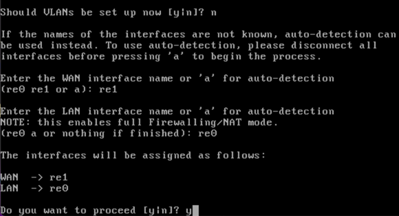
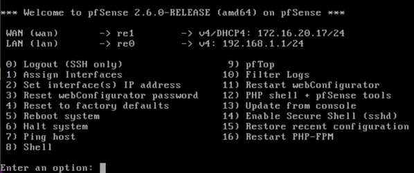
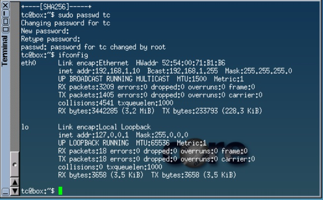
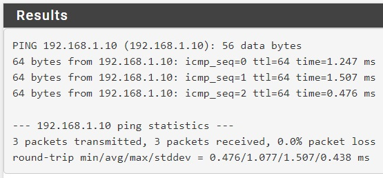
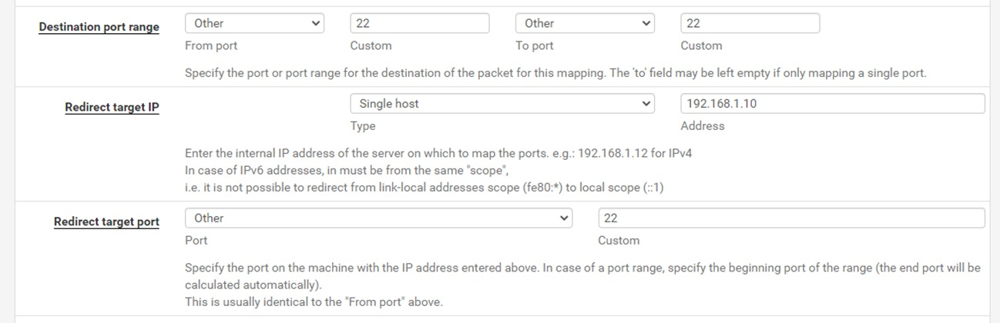
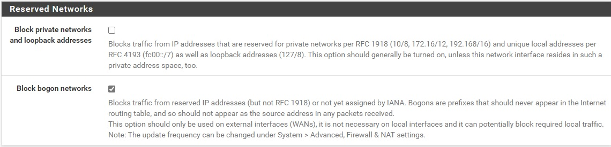

# Proof

For this I used Hyper-V, which required me to enable nested virtualisation on the VM named `Proof`:

```powershell
Set-VMProcessor -VMName 'Proof' -ExposeVirtualizationExtensions $True
```

I also had to disable secure boot. The OS I installed was Ubuntu 22.04.

Once the OS was installed, the first step is to create a directory which will contain the virtual disk and ISO images used for this proof:

```bash
mkdir /opt/vnet-proof
```

Then, I installed the required packages:

```bash
apt update
apt install qemu-kvm libvirt-daemon-system libvirt-clients qemu-utils openvswitch-switch openvswitch-common dnsmasq
usermod -aG libvirt $USER
usermod -aG kvm $USER
```

I downloaded the ISO images for:

 - TinyCore Linux
 - Kali Linux (Live CD)
 - pfSense

```bash
wget http://tinycorelinux.net/13.x/x86/release/TinyCore-current.iso -O /opt/vnet-proof/tinycore.iso
wget https://archive-4.kali.org/kali-images/kali-2022.3/kali-linux-2022.3-live-amd64.iso -O /opt/vnet-proof/kali.iso

wget https://atxfiles.netgate.com/mirror/downloads/pfSense-CE-2.6.0-RELEASE-amd64.iso.gz -O /opt/vnet-proof/pfsense.iso.gz
gunzip /opt/vnet-proof/pfsense.iso.gz
```

As this proof is going to make use of two networks, I used `ovs-vsctl` to create the virtual switches, the name I have given to these virtual switches are `internet` and `internal`, which represent a simulated internet and an internal network:

```bash
ovs-vsctl add-br internet
ovs-vsctl add-br internal
ip link set internet up
ip link set internal up
```

I then confgured what address space the internet network will use, it is `172.16.20.0/24`:

```bash
ip route add 172.16.20.0/24 dev internet
```

Next, I created an interface which will act as a default gateway for the `internet` network, this is required as traffic that is not intended for the local LAN will be sent to this interface:

```bash
ovs-vsctl add-port internet internet-gw -- set Interface internet-gw type=internal
ip addr change dev internet-gw 172.16.20.1
ip link set internet-gw up
```

I then created a DHCP server inside the `internet` network, this is so devices within this network will automatically get an IP address, the DHCP address range I set below is `172.16.20.10` - `172.16.20.20`.

```bash
ovs-vsctl add-port internet internet-dhcp -- set Interface internet-dhcp type=internal
ip addr change dev internet-dhcp 172.16.20.2
ip link set internet-dhcp up

dnsmasq --interface=internet-dhcp --except-interface=lo --bind-interfaces --dhcp-range=172.16.20.10,172.16.20.20,255.255.255.0,12h --dhcp-option=option:router,172.16.20.1 --dhcp-option=6,8.8.8.8
```

> Note that I did not configure a DHCP server for the `internal` network, this is because the DHCP service will be handled by pfSense

I segregate the network so that only traffic from the `eth0` interface is allowed into the networks, all else is dropped, this is to allow NAT'ed packets to enter the networks:

```bash
iptables -A FORWARD -i eth0 -o internet -j ACCEPT
iptables -A FORWARD -o internet -j DROP
iptables -A OUTPUT -o internet -j DROP

iptables -A FORWARD -i eth0 -o internal -j ACCEPT
iptables -A FORWARD -o internal -j DROP
iptables -A OUTPUT -o internal -j DROP
```

Masquerading is then enabled so that traffic going outside of the VM gets assigned the correct IP address so internet access is provided to the networks:

```bash
iptables -t nat -A POSTROUTING -o eth0 -j MASQUERADE
```

Before the virtual machines are started I create 3 virtual disks using the `qcow2` format which are all 5GiB in size:

```bash
qemu-img create -f qcow2 /opt/vnet-proof/tinycore 5G
qemu-img create -f qcow2 /opt/vnet-proof/pfsense 5G
qemu-img create -f qcow2 /opt/vnet-proof/kali 5G
```

The first virtual machine I started was the pfSense router, I done this so that I can configure the router through the web interface:

```bash
virsh create pfsense.xml
```

Once the VM was started I connected to the VNC port 5900 using [Tiger VNC](https://github.com/TigerVNC/tigervnc), the install successfully detected two interfaces and I assigned them to both the WAN and LAN:



Once the router was configured via the terminal the LAN was automatically assigned the network address space `192.168.1.0/24` and the WAN interface successfully got the IP address `172.16.20.17` from the DHCP server I configured earlier:



As the LAN has the address space `192.168.1.0/24`, I needed to add the following route so that traffic within that address space gets sent to the correct network:

```bash
ip route add 192.168.1.0/24 dev internal
```

The next step is to get the web configurator for pfSense available so I can access it and configure the router, to do that I quickly created an `iptables` rule that allows traffic from the host source address `192.168.0.37` to the address `192.168.1.1`, which is the LAN IP address of the pfSense router:

```bash
iptables -I OUTPUT -s 192.168.0.37/32 -d 192.168.1.1/32 -p tcp -j ACCEPT
```

I then installed `rinetd` which allowed me to do simple port forwarding on the host:

```bash
apt install rinetd
```

From which I the added the following to `/etc/rinetd.conf`:

`0.0.0.0         8443      192.168.1.1    443`

The above redirects all traffic destined for port 8443 on the host to the LAN IP address of the pfSense router, which we should be able to access now as we created the `iptables` rule earlier. For this change to be in effect I needed to restart the `rinetd` service:

```bash
systemctl restart rinetd
```

I managed to get access to the web configurator page but due to the fact I am accessing the internal interface using NAT I needed to temporarily disable security checks on the router, for this I simply issued the command:

```bash
touch /tmp/disable_security_checks
```

After this, I was able to successfully login useing the default credentials and setup the device.

Next, I started the TinyCore linux virtual machine:

```bash
virsh create tinycore.xml
```

Once started I issued the `ifconfig` command and got the IP address `192.168.1.10`, this shows the DHCP server on the pfSense router is working correctly:



I then used this IP address to make sure the pfSense router can communicate with the machine by pinging the IP address from the router:



Next, I configured port forwarding on the pfSense router, I forwarded port 22 on the WAN interface to port 22 on the TinyCore Linux machine (`192.168.1.10`):



Finally with the router configuration, due to the WAN interface of the router being accessed from a private address (RFC 1918), I needed uncheck the option which blocks traffic on the WAN with a private address as the source address:



Once this was done I started the OpenSSH server on the TinyCore Linux machine, installed nmap and set a password for the default `tc` user:

```bash
tce-load -wi dbus
tce-load -wi nmap
tce-load -wi openssh
sudo cp /usr/local/etc/ssh/sshd_config.orig /usr/local/etc/ssh/sshd_config
sudo /usr/local/etc/init.d openssh start
sudo passwd tc
```

Finally, I started the last VM which was the Kali Linux machine:

```bash
virsh create kali.xml
```

To test the network segregation is working I done an Nmap scan of `172.16.20.0/24` and `192.168.1.0/24`:

```bash
nmap -Pn -T5 172.16.20.0/24 > scan.172.16.20.0
nmap -Pn -T5 192.168.1.0/24 > scan.192.168.1.0
```

I then checked the results of the first scan for any open ports:

```bash
cat scan.172.16.20.0 | grep -C10 open
```

Which resulted in:

```
Nmap scan report for 172.16.20.16
Host is up.
All 1000 scanned ports on 172.16.20.16 are in ignored states.
Not shown: 1000 filtered tcp ports (no-response)

Nmap scan report for 172.16.20.17
Host is up (0.0022s latency).
Not shown: 999 filtered tcp ports (no-response)
PORT   STATE SERVICE
22/tcp open  ssh

Nmap scan report for 172.16.20.18
Host is up (0.00011s latency).
All 1000 scanned ports on 172.16.20.18 are in ignored states.
Not shown: 1000 closed tcp ports (conn-refused)

Nmap scan report for 172.16.20.19
Host is up.
All 1000 scanned ports on 172.16.20.19 are in ignored states.
Not shown: 1000 filtered tcp ports (no-response)
```

Checking the results of the second scan for any open ports did not show any (which is to be expected), and resulted in the following:

```
Nmap scan report for 192.168.1.0
Host is up.
Skipping host 192.168.1.0 due to host timeout
Nmap scan report for 192.168.1.1
Host is up.
Skipping host 192.168.1.1 due to host timeout
Nmap scan report for 192.168.1.2
Host is up.
Skipping host 192.168.1.2 due to host timeout
Nmap scan report for 192.168.1.3
Host is up.
Skipping host 192.168.1.3 due to host timeout
Nmap scan report for 192.168.1.4
Host is up.
Skipping host 192.168.1.4 due to host timeout
Nmap scan report for 192.168.1.5
Host is up.
Skipping host 192.168.1.5 due to host timeout
...
```

The results above show that:

 - The `internet` network shows that port 22 on `172.16.20.17` is open, which is correct
  - The scan for the `internal` network was taking a very long time to complete, which I assume is because of the amount of retries that were occurring as the packets were simply being dropped due to the `iptables` rules I created earlier

I then SSH'ed into the TinyCore Linux machine from the Kali machine via the forwarded port on the router and performed another nmap scan of the `internet` and `internal` network:

```bash
nmap -Pn -T5 192.168.1.0/24 > internal-scan.192.168.1.0
nmap -Pn -T5 172.16.20.0/24 > internal-scan.172.16.20.0
```

After this I checked the results of the first scan for any open ports:

```bash
cat internal-scan.192.168.1.0 | grep -C10 open
```

Which resulted in:

```
Nmap scan report for 192.168.1.0
Host is up.
All 1000 scanned ports on 192.168.1.0 are filtered

Nmap scan report for pfSense.home.arpa (192.168.1.1)
Host is up (0.0011s latency).
Not shown: 997 filtered ports
PORT    STATE SERVICE
53/tcp  open  domain
80/tcp  open  http
443/tcp open  https

Nmap scan report for 192.168.1.2
Host is up.
All 1000 scanned ports on 192.168.1.2 are filtered

Nmap scan report for 192.168.1.3
Host is up.
All 1000 scanned ports on 192.168.1.3 are filtered

Nmap scan report for 192.168.1.4
```

```
All 1000 scanned ports on 192.168.1.8 are filtered

Nmap scan report for 192.168.1.9
Host is up.
All 1000 scanned ports on 192.168.1.9 are filtered

Nmap scan report for 192.168.1.10
Host is up (0.00018s latency).
Not shown: 999 closed ports
PORT   STATE SERVICE
22/tcp open  ssh

Nmap scan report for 192.168.1.11
Host is up.
All 1000 scanned ports on 192.168.1.11 are filtered

Nmap scan report for 192.168.1.12
Host is up.
All 1000 scanned ports on 192.168.1.12 are filtered

Nmap scan report for 192.168.1.13
```

I then checked the results of the second scan for any open ports:

```bash
cat internal-scan.172.16.20.0 | grep -C10 open
```

Which resulted in:

```
All 1000 scanned ports on 172.16.20.15 are filtered

Nmap scan report for 172.16.20.16
Host is up.
All 1000 scanned ports on 172.16.20.16 are filtered

Nmap scan report for 172.16.20.17
Host is up (0.0011s latency).
Not shown: 997 filtered ports
PORT    STATE SERVICE
53/tcp  open  domain
80/tcp  open  http
443/tcp open  https

Nmap scan report for 172.16.20.18
Host is up.
All 1000 scanned ports on 172.16.20.18 are filtered

Nmap scan report for 172.16.20.19
Host is up.
All 1000 scanned ports on 172.16.20.19 are filtered

Nmap scan report for 172.16.20.20
Host is up.
```

The results above show that:

 - The `internal` network shows that port 53, 80 & 443 on `192.168.1.1` are open and port 22 is open on `192.168.1.10`, which is correct
 - The scan on the `internet` network shows that port 53, 80 & 443 on `172.16.20.17` are open

The reason that the `internal` network can access hosts on the `internet` network is because traffic is first sent to the router then onto the host:

```bash
traceroute 172.16.20.18
```

Which outputs:

```
traceroute to 172.16.20.18 (172.16.20.18), 30 hops max, 38 byte packets
 1  pfSense.home.arpa (192.168.1.1)  0.568 ms  0.617 ms  0.118 ms
 2  172.16.20.18 (172.16.20.18)  1.664 ms  0.818 ms  0.741 ms
```

This shows that the network segregation is working as intended.